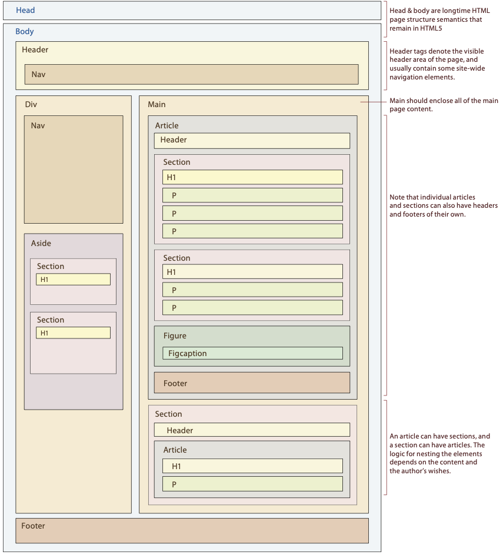

# Tarea 8 - Creación de página web con Bootstrap May 22, 2021, 23:59 CST

Implemente la página web, que diseñó en la Tarea 7, utilizando el framework CSS [Bootstrap](https://getbootstrap.com).

Para ello debe seguir el esquema de etiquetas HTML5 que se muestran en la figura de abajo. Esto significa que debe minimizar el uso de etiquetas `<div` y utilizar las etiquetas HTML5 adecuadas que definan claramente la estructura de la información en la página.

Debe subir al Classroom todo el código HTML y CSS utilizado . Además, debe publicar el resultado en algún sitio web.
